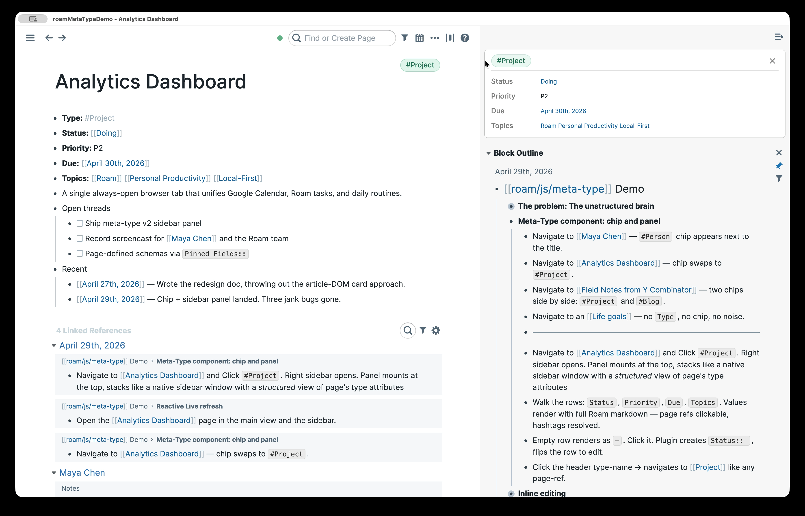
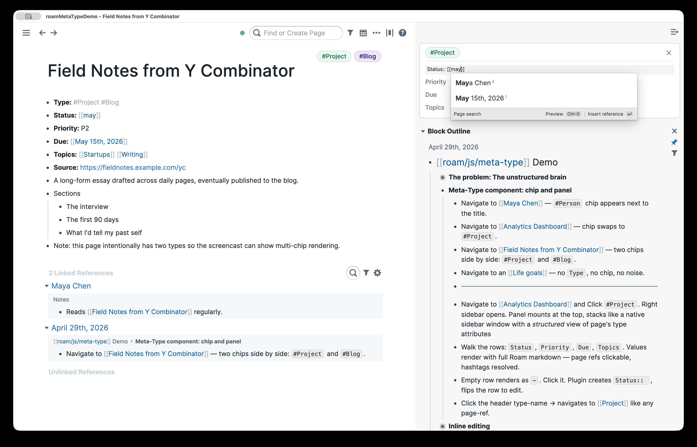

# roam-meta-type

Typed pages for Roam Research. Add a `Type::` attribute to a page and a chip appears next to the title; click it to open a sidebar panel with the fields you care about for that type.

## Encouraging Structure for Your Second Brain

Roam's freedom as an outline is the whole point. But the people, projects, books, and articles I keep coming back to all have *some* structure: an email, a status, a due date, an author. Today that structure is invisible — you have to read the page to learn what kind of thing it is, and scan the outline to find the fields that matter.

`roam-meta-type` keeps the outline. It just makes the structure visible.

## What it does

1. Unobtrusive pill-shaped **chip** page identification based on supported `Type::` attribute. Multi-typed pages (`Type:: #Project #Blog`) get one chip per type.
2. Click a chip → a **panel** mounts at the top of Roam's right sidebar with that type's pinned fields, rendered as label/value rows.
   
3. Sidepanel is an integrated **inline-editor**. Click any row → it flips to inline edit mode using Roam's own block editor (autocomplete, page-refs, formatting — all of it). Click any value to flip the row into Roam's block editor. Empty rows render as `—`. Click and the plugin creates the missing block (e.g. `Status:: `) before flipping into edit mode.
   
4. Sidepanel reactively refreshes to updates **live**: edit `Priority::` directly in the page body, the panel updates without a re-render.
5. **Configurable** types, fields, and accent colors via the Roam settings panel (no source edits required).

## Install (developer mode)

This extension is being prepared for the Roam Depot. Until it's published, install it as a local Developer Extension:

1. Clone this repo locally:
   ```bash
   git clone https://github.com/wireframe/roam-meta-type.git
   cd roam-meta-type
   npm install
   npm run build
   ```
   This produces `extension.js` at the repo root.
2. In Roam: Settings → **Roam Depot** → **Installed Extensions** → gear icon → enable **Developer mode**.
3. A **Developer Extensions** section appears with a folder-plus icon. Click it and choose this repo's folder.
4. The extension loads. Open any page with a `Type::` attribute and you should see a chip appear.

To reload after editing source: rebuild (`npm run build`), then in Roam press **`control-d control-r`**. Roam unloads the extension, reads the new `extension.js`, and reloads.

To uninstall, remove it from the Developer Extensions list in Roam settings.

## Configuring types

Open Roam **Settings → Meta Type**. The settings tab shows a Blueprint table with one row per configured type. Each row has:

- **Name** — the type name. Must match the page-ref in `Type::` blocks (e.g., `Project`).
- **Hue** and **Saturation** — HSL components for the chip's accent color (hue 0–360, saturation 0–100; lightness is computed). A small swatch preview updates as you type.
- **Fields** — comma-separated list of field names (e.g., `Status, Priority, Due, Topics`). Each becomes a row in the sidebar panel.
- A trash button on the right to remove the row.

Below the table are **Add type** (appends a blank row) and **Save**. Click **Save** to persist; the extension closes any open panels and re-renders chips with the new config.

The default config ships 7 types: `Organization`, `Person`, `Project`, `Blog`, `document`, `article`, `book`. The first time you open the settings tab, you'll see those rows pre-populated. Add, edit, or remove rows freely.

Two settings are not exposed in the UI and remain at their defaults:

- `typePrefix` — the block prefix used to detect typed pages (default `Type::`).
- `flashColor` — the RGB highlight color for the click-flash animation (default `{ r: 16, g: 107, b: 163 }`).

These are stored in the same JSON value as the types and preserved on every save. Power users who need to change them can edit the underlying setting key directly via Roam's developer tools (key: `types-config` under this extension's settings).

If the stored JSON is missing or malformed (e.g., from a manual edit gone wrong), the extension falls back to the canonical defaults and logs a warning to the browser console.

## How a page gets typed

Add a `Type::` attribute as a top-level block on the page, with one or more `#TypeName` references:

```
- Type:: #Project
- Status:: Doing
- Priority:: P1
- Due:: [[April 30th, 2026]]
- Topics:: [[Roam]] [[Productivity]]
```

The plugin reads `Type::`, looks each reference up in the configured types, and renders one chip per known type. Unknown types are silently skipped — no chip, no error.

## Development

```bash
npm install         # vitest, esbuild, dev deps
npm test            # run unit tests (vitest)
npm run build       # rebuild extension.js with esbuild
```

The build uses [esbuild](https://esbuild.github.io/) with a small custom plugin (`bin/build.mjs`) that externalizes React, ReactDOM, and BlueprintJS to Roam's `window.*` globals — Roam Depot mandates that extensions consume these from there rather than re-bundling them. Source code uses standard ESM imports (`import { Button } from "@blueprintjs/core"`); the plugin remaps them at bundle time.

When adding a new named import from React or BlueprintJS, update the `knownExports` table in `bin/build.mjs` — esbuild fails the build with "no matching export" if a named symbol is missing.

The output `extension.js` is a single ESM file with `export default { onload, onunload }` — the Roam Depot plugin contract.

## Architecture (one-paragraph version)

The extension exports `{ onload({ extensionAPI }), onunload() }`. On load it reads the config from `extensionAPI.settings` (key: `types-config`, JSON-encoded with fallback to baked-in defaults), registers a Blueprint-based settings panel under "Meta Type" using `extensionAPI.settings.panel.create({ action: { type: "reactComponent", ... } })`, injects styles, installs document-level listeners for click-outside-to-exit-edit and Escape-to-exit-edit, registers a chip-click delegation listener on `document.body`, and starts a `MutationObserver` on `.rm-title-display` for page navigation. Every setup operation registers a corresponding cleanup with a small LIFO teardown registry; on unload everything is reversed in reverse-registration order so the observer is silenced before the DOM is torn down. On navigation, the plugin queries the page's `Type::` attribute, removes any old chips, and renders new ones as siblings of the title element. Clicking a chip opens Roam's right sidebar via `roamAlphaAPI.ui.rightSidebar.open()` and prepends a custom panel `<div>` to `#roam-right-sidebar-content`. Each open panel registers a `roamAlphaAPI.data.addPullWatch` rooted at the page UID; the callback diffs new field values and re-renders affected rows without disturbing rows in edit mode (Roam's block editor, mounted via `roamAlphaAPI.ui.components.renderBlock`, owns that DOM until the user blurs). When the user saves a config change in the settings panel, all open panels close, chips re-mount with the new types/colors, and the flash style re-injects with the new RGB.

## License

[MIT](LICENSE).
